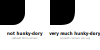

# Better rounded corners

*for HTML divs in React.js*

`react-round-div` makes your rounded rectangles look smoother for a more pleasant feel. The package
weighs [just under 10KB](#size) and has an almost "plug and play"-integration into your code, so that you have to do
next to nothing to up the style of your project.

Here is a very clear demonstration of these smooth corners:



- [Installation](#installation)
- [Usage](#usage)
    - [Options](#options)
        - [`dontConvertShadow`](#dontconvertshadow)
- [Things to note & caveats](#things-to-note--caveats)
    - [Intended differences to the html `<div>`](#intended-differences-to-the-html-div)
    - [webpack](#webpack)

## Installation

```shell
npm i react-round-div
```

#### Size

|                                  |  Gzipped | Minified + Gzipped |
|----------------------------------|---------:|-------------------:|
| `react-round-div`                |   7.8 KB |            5.28 KB |
| `react-round-div` + dependencies | 14.97 KB |        **9.17 KB** |

## Usage

Simply import the package and replace any divs with rounded corners (`border-radius`) that you want to
improve. `react-round-div` will handle the rest.

```jsx  
import RoundDiv from 'react-round-div';

const App = () => {
    return (
        <RoundDiv>
            <p>Hello smooth corners!</p>
        </RoundDiv>
    )
};

export default App;
```

Also, [turn off or polyfill `url`, `path`, and `fs`](#webpack)

### Options

#### `dontConvertShadow`

If you have set a `box-shadow` in your CSS, `react-round-div` will convert it to
a [`drop-shadow()`](https://developer.mozilla.org/en-US/docs/Web/CSS/filter-function/drop-shadow()). This happens
because otherwise, the old rounded corners may shine through. If you want `react-round-div` to not convert
your `box-shadow`s, add the `dontConvertShadow` option:

```jsx  
<RoundDiv dontConvertShadow>
    <p>Content</p>
</RoundDiv>
```

## Things to note & caveats

This package is still in the starting blocks, some cases where it might not behave as expected. For example, some border
styles are not rendered correctly, and some transitions and animations on the div may not work properly.

There are a couple of css properties, that you can't reliably set _inline_ with `RoundDiv`:

- the `background` property and all the properties it is a shorthand for
- the `border`, `border-image`, and all the properties they are a shorthand for
- `box-shadow`
- `filter`, if you haven't set [`dontConvertShadow`](#dontconvertshadow)

You shouldn't set these properties inline. Instead, set them in a stylesheet. This behaviour may change in future
versions. The `filter` property in particular will only not work, if you have set a `box-shadow` AND have not
set [`dontConvertShadow`](#dontconvertshadow). This may also change in future versions.

### Intended differences to the html `<div>`

Unlike the html `<div>`, `RoundDiv` still rounds the corners of borders of there is a border image set. This looks great with gradients, but might clash with the use of actual images as borders.

### webpack

If you use a preprocessor like webpack (which you most likely are), you need to turn off or polyfill the node
modules `url` and `path`, and turn off `fs`. This is due to the module [`css`](https://www.npmjs.com/package/css), which
uses them. In webpack, you can do this with
the [`resolve.fallback.<module_name>`](https://webpack.js.org/configuration/resolve/#resolvefallback) option:

```javascript
module.exports = {
    resolve: {
        fallback: {
            path: false,
            url: false,
            fs: false,
        }
    }
}
```

If you use `create-react-app`, take a look at [`react-app-rewired`](https://www.npmjs.com/package/react-app-rewired).
