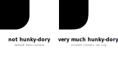

# Better rounded corners

*for HTML divs in React.js*

`react-round-div` makes your rounded rectangles look smoother for a more pleasant feel. With a simple and easy
integration into your code you have to do almost nothing to up the style of your project.

Here is a very clear demonstration of these smooth corners:



## Installation

```shell
npm i react-round-div
```

## Usage

Simply import the package and replace any divs with rounded corners (`border-radius`) that you want to
improve. `react-round-div` will handle the rest.

```jsx  
import RoundDiv from 'react-round-div';

const App = () => {
    return (
        <RoundDiv>
            <p>Hello smooth corners!</p>
        </RoundDiv>
    )
};

export default App;
```

### Options

#### `dontConvertShadow`

If you have set a `box-shadow` in your CSS, `react-round-div` will convert it to
a [`drop-shadow()`](https://developer.mozilla.org/en-US/docs/Web/CSS/filter-function/drop-shadow()). This happens
because otherwise, the old rounded corners may shine through. If you want `react-round-div` to not convert
your `box-shadow`s, add the `dontConvertShadow` option:

```jsx  
<RoundDiv dontConvertShadow>
    <p>Content</p>
</RoundDiv>
```

## Things to note & caveats

This package is still in the starting blocks, so for now borders are only supported in the `solid` style and transitions
and animations on the div may not work properly.

There are a couple of css properties, that you can't reliably set with `RoundDiv`:

- the `background` property and all the properties it is a shorthand for
- `border-color`
- `box-shadow`
- `filter`, if you haven't set [`dontConvertShadow`](#dontconvertshadow)

You shouldn't set these properties inline. Instead, set them in a stylesheet. This may change in future versions.  
The `filter` property in particular will not work at all, if you have set a `box-shadow` AND have not
set [`dontConvertShadow`](#dontconvertshadow). This may also change in future versions.
